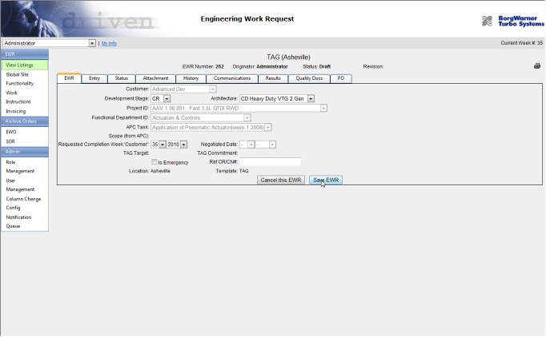

# Introduction

This professional portfolio contains a showcase of systems I have designed and developed to solve a variety of business problems. The goal of this document is to provide examples that demonstrate the breadth and depth of my experience. This is intended to be viewed in conjunction with my professional resume.

If you are viewing this and have not been provided with my resume yet, please contact me at Mark.Johnston@yahoo.com.

# OSI Next

**OSI Next** is a modern update to a legacy desktop/services system, OSI, which supports the Operations and Engineering areas of a natural gas pipeline company. OSI Next is intended to eventually house all sub-systems currently contained in its legacy namesake. The first subsystem added to OSI Next was Gas Storage, used to support the asset-tracking needs of the underground Gas Storage group. OSI Next used the latest web-based technology, offering a responsive experience for both PC and mobile users.

I was the architect, technical lead, and developer for this project.

## Tech Stack

- Microsoft .NET Core 2.1
- Entity Framework Core 2.1
- SQL Server
- REST/WebAPI
- TypeScript
- Angular 6.1
- Angular Material Design Components
- RxJS
- Jasmine/Karma
- VSTS Builds
- Octopus Deploy

## Architectural Details

OSI Next is a Single-Page-Application with a RESTful web backend. All API interactions are asynchronous on both the client (using RxJS) and API (using .NET async/await), providing a high-performing and scalable solution. Great care was taken to keep the system modular and decoupled in order to provide a highly-maintainable system for future growth. Both the backend and client were thoroughly unit-tested. Continuous Integration and automated deployments provided a reliable and consistent experience for the operation of the system.

## Business Value

OSI Next has proven to be a vast improvement in usability and performance over its predecessor. The turnaround time for developing and deploying new features has been significantly decreased. The increased usability of a responsive web application, compared to the legacy desktop application, has given the business users much greater flexibility as they interact with the valuable asset data.

# Mobile Workforce

**Mobile Workforce** is a full-stack solution featuring a touch-friendly desktop client application which gives remote users the ability to interact with data from multiple backend systems as well as access to rich mapping capabilities while working in remote areas where connectivity is not available. A services layer provides seamless integration with backend systems. The improvements provided by this system helped to increase the company's operational efficiency while greatly improving the accuracy of captured data.

I was a key contributor to the architecture, development, integration, administration and maintenance of this system.

## Tech Stack

- Microsoft .NET 4.5 (C#)
- Desktop Client: WPF / XAML / Prism / MVVM
- Web-based Tools: ASP.NET MVC 5, AngularJS
- Web services: WCF / WebAPI
- Custom Windows Services
- Windows Service Bus 1.0
- SQL Server Reporting Services
- ESRI ArcGIS Runtime
- Telerik WPF Controls
- RavenDb (Embedded)
- VSTS Builds
- Octopus Deploy

## Architectural Details

Mobile Workforce is designed to follow the Command and Query Responsibility Segregation (CQRS) architectural pattern, using separate paths for read and write operations. Maintenance and service data is created or modified in the backend systems and then flows through the respective Web or Windows Service where it is transformed and stored for consumption by the client. Responses from the client are sent through a Web Service into message queues, where they are retrieved by a Windows Service and then applied to the respective backend system. (See diagram below)

Mapping data is generated from the GIS system periodically and provided to the client in a similar fashion to data from the other systems, however due to business requirements there is no editing of map data allowed on the client.

## Business Value

This system provides a key piece of the company's long-term strategy to empower and automate its field workforce. The overall efficiency of field operations has improved dramatically as the staff is now able to perform most of their daily tasks from a single desktop client application from the convenience of their vehicle without having to leave the work-site. The accuracy and consistency of data provided by field personnel has increased, which has decreased the time required by office personnel as well as reduced the company's exposure to risk. Additionally, the Mobile Workforce platform's modular design allows new features and integration targets to be added with a minimal amount of change.

# OPC Slideshow

**OPC Slideshow** is a small, personal web-based project that presents contest entries during the monthly meetings of the Owensboro Photography Club. The original process was time-consuming, inconsistent, and involved individually resizing and editing each image to overlay a reference number. This app displays a full-screen slideshow of images from a selected Facebook album (using the albums owned by the logged-in user), and automatically overlays a number using styled HTML. Several options are available to control different aspects of the slideshow. This is available for viewing at: [http://
opcslideshow.azurewebsites.net](http://
opcslideshow.azurewebsites.net)

I was the sole developer for this project.

*Note: The policy for Facebook APIs has recently changed. The APIs will likely be limited to those with a formal business entity, which this project is not. There's a possibility this integration could suddenly cease to work.*

## Tech Stack

- AngularJS
- Bootstrap
- ASP.NET Web Optimization Framework
- Facebook Graph API

## Architectural Details

This app uses AngularJS to consume the Facebook Graph API and an open-source AngularJS Service to encapsulate the logic for sending the browser to and from full-screen display mode. (See screenshots below)

The main screen shows the list of available Albums, thumbnails of images from the selected Album, and options for the slideshow.

The slideshow uses the browser's full-screen display mode. The current image's position is displayed at the top-left. Controls to pause, resume, or stop the show are at the top-right. If selected, the image's description is at the bottom.

# Fulfillment System

The **Fulfillment System** includes a series of independent backend services exchange electronic messages that handle the receiving, parsing, validating, processing, shipping, and billing of order data. It also includes a rich desktop application that delivers deep visibility into the Fulfillment System’s activities, greatly reducing time spent by Operations and Customer Service staff. This system introduced substantial improvements and cost savings to the company’s fulfillment operations.

I was the sole technical resource involved in designing and developing this system from start to finish.

## Tech Stack

- Microsoft .NET 4.0 (C#)
- Client: WPF / XAML / MVVM
- Custom Windows Services
- NServiceBus / Microsoft Message Queue
- SQL Server Reporting Services
- Google Chart API

# Architectural Details

The Fulfillment System’s backend design is based on the Service Bus architectural pattern, which sends event-driven messages through a series of autonomous services. The services closely mirror the components of the business process, forming a pipeline through which order data is received, order details validated, inventory reserved, picking and shipping details assigned, and shipment confirmations sent to the customers. (See diagram below)

The Fulfillment System Management Application employs the MVVM (Model-View-ViewModel) architectural pattern leveraging WPF (Windows Presentation Foundation) as a user-interface technology. This combination, along with the sharing of business-layer code with the Fulfillment System’s backend codebase, provided a rapid development experience that allowed focus to remain on the business requirements rather than on tedious coding tasks. (See screenshots below)

The Fulfillment System Management’s Dashboard shows Order activity and alerts operators of any errors.

The Fulfillment System Management’s Order Details screen shows all details for the selected order.

## Business Value

In the 6 months following implementation, this system exceeded all expectations. It proved its efficiency by dramatically reducing order processing time and increasing accuracy. It performed reliably, and even recovered gracefully from several unexpected power outages without any data loss or corruption. Its flexible design allowed rapid modification with a low degree of friction as business needs evolved. This client application provided valuable visibility into the Fulfillment System processing pipeline, reduced the time spent by Operations and Customer Service staff to manage interactions with the Fulfillment System, and increased the speed and accuracy of information provided to customers.

# Engineering Work Request (EWR)

**Engineering Work Request (EWR)** is a web-based application used by a global manufacturing organization to coordinate the flow of work requests between business users and engineers located across the company’s multiple international locations. The goal of the EWR system was to replace a legacy system that did not offer the efficiency and flexibility to keep pace with dynamic business requirements.

I was the primary designer and developer of this system.

## Tech Stack

- Microsoft.NET 3.5 (C#)
- ASP.Net WebForms
- Custom Windows Service
- Telerik RAD Controls
- CodeSmith / NetTiers
- jQuery

## Architectural Details

The data access and service layers of the EWR system were created using a code generation template (NetTiers). This allowed rapid and painless updates to the system based on changes originating to the underlying database.

Data-binding capabilities were added to a set of custom-developed web controls. This allowed for rapid development of screens without having to write repetitive code for populating and retrieving data.

Another key feature of the system was dynamic field-level auditing. A configuration screen used reflection to provide administrators with a list of available fields from which they could select which were subject to audits. At runtime, the system used a cached list of these audited fields to determine if the incoming values should be captured.

This screen shows editing of an Engineering Work Request instance.

This shows the Column Change Config screen, used to configure the dynamic field-level Auditing.

## Business Value

The new system provided a higher degree of efficiency, greater transparency, and improved communications over the legacy system. The client was able to more quickly respond to change and their bottlenecks were removed.
